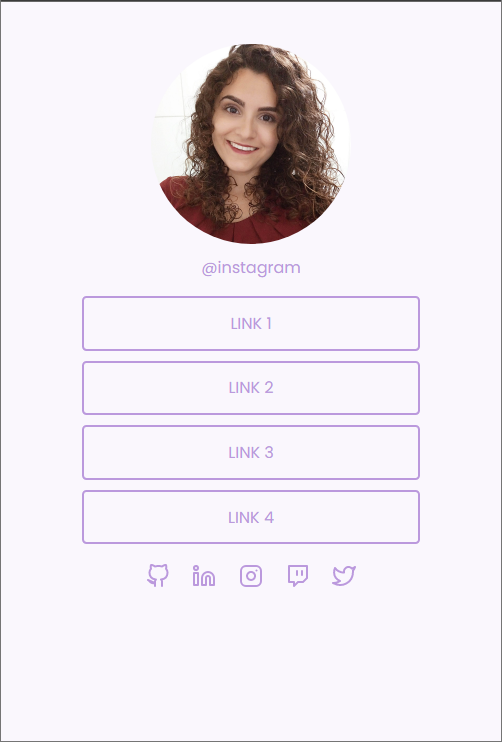

# Social Tree
Desafio do Discover da Rocketseat

* Este é um desafio da Trilha Fundamentar do Discover da Rocketseat.
* Foram usadas as linguagens HTML e CSS.
* O layout foi baseado em um projeto no Figma: https://www.figma.com/file/yi1ycIyAW8QiGiX9bMFHkU/DD-%2F-Social-links/duplicate

* Este é o resultado final:

